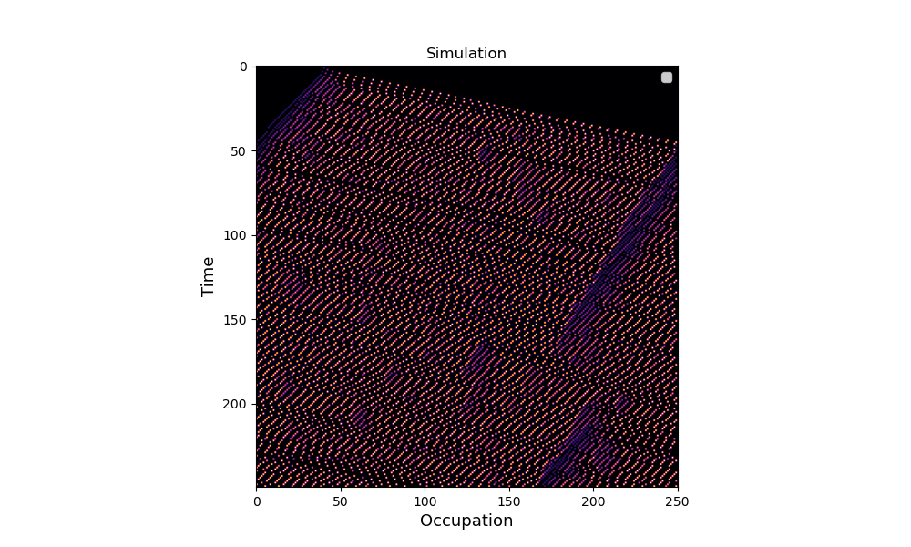

# Traffic Sim

An implementation of the Nagel-Schreckenberg Model with periodic boundary conditions.

## Description

The code simulates traffic flow on a road with periodic boundary conditions (essentially a loop). The idea behind the simulation is to demonstrate how simple rules (only paying attention to the front car) can generate complex phenomena, like traffic jams. Additionally, a non-deterministic probability "p_break" is added to every agent.

## Getting Started

### Dependencies

- numpy >= 1.20.1
- matplotlib >= 3.3.4
- argparse

### Executing program

The script for running the simulation is:
```
src/main.py
```

The variables from the simulation are: 

```
n_cars = Number of agents on the road 
length = Lenght of the road 
p_break = Random Probability of agent decreasing velocity 
steps = Steps of the simulation 

```
To run the actual simulation:

```
cd src/
python main.py -N n_cars -L length -P p_break -S steps
```

An example with N = 40, L = 250, P=0.1 and S=250



## License

Traffic Sim is licensed under the terms of the MIT License (see the file LICENSE).- see the LICENSE for details
